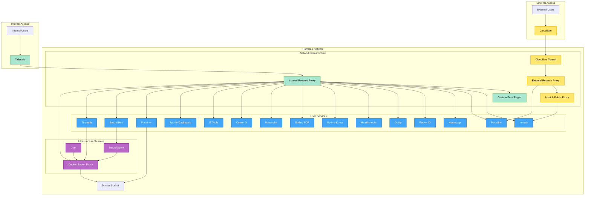

# Self-Hosted Services

You can find the configurations for each of the services I self-host in the accompanying directories, with descriptions of each [below](#services).

The services are managed using [Portainer](#portainer) and [Docker Compose](https://docs.docker.com/compose/). For just Docker Compose usage, you can use the following commands:

## Commands

### Create `.env` file

```sh
cp .env.example .env
# Fill in the required variables
```

### Start services

```sh
docker network create proxy-internal
docker network create proxy-external
docker network create proxy-plausible --internal
docker network create proxy-immich-public --internal
docker compose up -d
```

### Stop services

```sh
docker compose down
```

### Update services

```sh
docker compose pull
docker compose up -d
docker image prune -f
```

## Network Diagram

This diagram gives an overview of the services I run and how they interact with each other and the outside world.



## Services

### [Portainer](./portainer/)

[Portainer](https://portainer.io/) is a lightweight management UI that allows you to easily manage your Docker containers, images, networks, and volumes. I use it to deploy and manage my self-hosted services, using the GitOps feature to automatically deploy changes to my services when I push to this repository. I also run a Portainer agent on my ODROID N2+ to manage the staging environment.

### [Caddy](./caddy/)

I use [Caddy](https://caddyserver.com/) as the reverse proxy for my services due to its robust feature set and ease of use. I use a custom build that includes the [Caddy-Docker-Proxy](https://github.com/lucaslorentz/caddy-docker-proxy) and [Cloudflare DNS](https://github.com/caddy-dns/cloudflare) plugins for label-based configuration and automatic SSL certificate management.

I also use [Error Pages](https://github.com/tarampampam/error-pages) to provide custom error pages for my services, resulting in more user-friendly error information.

### [Beszel](./beszel/)

[Beszel](https://beszel.dev/) is a lightweight server monitoring platform that includes Docker statistics, historical data, and alert functions. I use it as the main monitoring tool for my homelab, providing insights into the performance and health of my machines.

### [Pocket ID](./pocket-id/)

My authentication service of choice is [Pocket ID](https://pocket-id.org/). It is a self-hosted identity provider that supports OpenID Connect and OAuth 2.0, allowing me to manage user authentication and authorization for my applications securely. I chose it for its simplicity, clean UI, ease of integration, and focus on passwordless authentication.

### [Tinyauth](./tinyauth/)

[Tinyauth](https://tinyauth.app) is an application that enables authentication in front of services that do not natively support it. For my use case specifically, it allows me to use Tinyauth as an authentication proxy for Pocket ID with Caddy. This means I can protect any service behind Caddy with Pocket ID authentication, and even provide OAuth account functionality to some services through user headers, such as [Healthchecks](#healthchecks).

### [Diun](./diun/)

[Docker Image Update Notifier (Diun)](https://crazymax.dev/diun/) is an application for receiving notifications when a Docker image is updated on a Docker registry. I use it to monitor my important containers and notify me via 3rd-party integrations when a new image version is found.

### [Homepage](./homepage/)

I use [Homepage](https://gethomepage.dev/) as the central dashboard for my homelab. It provides a customizable and user-friendly interface to access and manage all my services in one place.

### [Uptime Kuma](./uptime-kuma/)

To monitor the uptime of my services, I use [Uptime Kuma](https://github.com/louislam/uptime-kuma). It is a feature-rich monitoring tool that supports various check types, has many notification options, and has a status page builder.

### [Healthchecks](./healthchecks/)

[Healthchecks](https://healthchecks.io/) is a cron job and background task monitoring service. It allows you to create "check-ins" for your scheduled tasks, and if a task fails to check in within a specified time frame, it sends you an alert via email or other notification methods. I use it to monitor various scheduled tasks and ensure they are running as expected.

### [Docker Socket Proxy](./socket-proxy/)

Due to some services' reliance on connection to the docker socket, I use [Docker Socket Proxy](https://github.com/wollomatic/socket-proxy) to securely expose the Docker API to my services in read-only mode without giving them direct access to the Docker daemon (with the exception of Portainer, which requires full access).

### [Immich](./immich/)

[Immich](https://immich.app/) is a self-hosted photo and video storage solution with functionality similar to Google Photos. It allows you to automatically back up your photos and videos from your devices, providing a web interface to view and manage your media. It is my primary photo and video management solution.

I also run [Immich Public Proxy](https://github.com/alangrainger/immich-public-proxy) to provide secure external access to link shares and public albums without exposing the main Immich server directly to the internet.

### [Cloudflared](./cloudflared/)

To facilitate secure public access to a subset of my services, I use [Cloudflared](https://github.com/cloudflare/cloudflared) to create secure tunnels to my internal services. This allows me to expose specific services to the internet without exposing my entire network.

### [Plausible](./plausible/)

[Plausible](https://plausible.io/) is a web analytics tool that is privacy-friendly and compliant with GDPR. It provides insights into website traffic without compromising user privacy. I use it to track and analyze the traffic to my internal and external services.

### [Stirling PDF](./stirling-pdf/)

I use [Stirling PDF](https://www.stirlingpdf.com/) for all my PDF needs. It is a self-hosted tool that allows you to merge, split, and manipulate PDF files easily without giving up your privacy.

### [Spotify Dashboard](./spotify-dashboard/)

[Spotify Dashboard](https://github.com/Yooooomi/your_spotify) is purely for displaying historical listening data. It is not a replacement for the Spotify app, but rather a nice tool to visualize your listening habits and statistics over time.

### [Mazanoke](./mazanoke/)

I run [Mazanoke](https://mazanoke.com/) for easy photo compression and conversion. It provides a clean web interface and runs completely in the browser, making it a convenient tool for quick image processing tasks.

### [ConvertX](./convertx/)

[ConvertX](https://github.com/C4illin/ConvertX) is a file conversion service that allows you to convert various file types easily from a simple web interface.

### [IT Tools](./it-tools/)

[IT Tools](https://github.com/sharevb/it-tools) is a collection of useful tools for IT professionals and software developers, including key generators, network tools, cheat sheets, and more.
